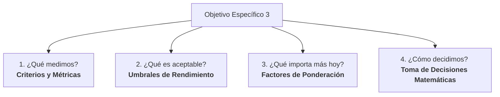

# Guía Explicativa del Objetivo Específico 3: Selección y Evaluación de CNI en Kubernetes

Este documento desglosa el **Objetivo Específico 3** de la tesis en términos sencillos, prácticos y con analogías del mundo real. Está diseñado para que cualquier profesional del sector tecnológico (desarrolladores, administradores de sistemas o DevOps juniors) pueda comprender qué se está midiendo, por qué es importante, de dónde provienen los datos y cómo funciona el modelo matemático de decisión.

---

## 1. El Objetivo Específico 3 en Palabras Sencillas

El texto académico del objetivo dice:
> *"Desarrollar, como parte del modelo propuesto, un conjunto de criterios y métricas que permitan la comparación objetiva entre diferentes CNI para Kubernetes mediante la definición de umbrales de rendimiento y factores de ponderación, para facilitar la toma de decisiones técnicas basadas en evidencia cuantificable."*

Si lo traducimos al lenguaje del día a día, el objetivo busca responder a la siguiente pregunta:
**¿Cómo elijo el mejor plugin de red (CNI) para mi clúster de Kubernetes de forma justa, científica y adaptada a mi negocio, en lugar de elegir el que está "de moda"?**

Para lograrlo, el objetivo se divide en cuatro piezas clave:



---

## 2. La Analogía del Mundo Real: El Dilema del Transporte

Imagina que tienes una empresa y necesitas contratar un servicio de transporte (tu CNI). Tienes tres opciones de vehículos para mover tus paquetes (los datos de tus aplicaciones):

1. **La Bicicleta de Reparto (Flannel):** Es súper ligera, barata de mantener (consume casi nada de RAM/CPU), pasa por cualquier callejón estrecho y es rápida para tramos cortos. Sin embargo, no tiene cerradura de seguridad (no soporta Network Policies) y no puedes llevar un cargamento gigante.
2. **El Camión de Carga (Calico / Antrea):** Es rápido en autopista, puede llevar mucho volumen de carga (alto throughput) y tiene puertas con llave (seguridad básica con Network Policies). Consume más gasolina (recursos) que la bicicleta, pero es muy balanceado.
3. **El Camión Blindado de Valores (Cilium):** Tiene guardias armados, escaneo de paquetes en tiempo real y blindaje de última tecnología (eBPF y políticas de seguridad avanzadas a nivel L7). Es sumamente seguro, pero es pesado, lento en arrancar y consume muchísima gasolina (alto consumo de RAM y CPU).

> [!IMPORTANT]
> **No existe el "mejor vehículo" absoluto.** Si necesitas llevar una pizza caliente a 3 cuadras en tráfico pesado, el camión blindado es una pésima opción. Si necesitas transportar millones de dólares entre bancos, la bicicleta es un peligro de seguridad. El CNI correcto depende de tu **caso de uso**.

---

## 3. Desglose Paso a Paso del Objetivo

### Parte 1: Criterios y Métricas (¿Qué medimos?)

Para comparar los CNI de forma objetiva, evaluamos tres grandes áreas (los **Criterios**), y dentro de cada una medimos variables específicas (las **Métricas**):

| Criterio | ¿Qué significa en la vida real? | Métrica Técnica | Explicación Simple |
| :--- | :--- | :--- | :--- |
| **C1: Rendimiento de Red** | ¿Qué tan rápido y estable viaja la información? | **Latencia TCP (ms)** | El tiempo que tarda un paquete en ir de un Pod a otro y recibir confirmación (como el delay en una videollamada). |
| | | **Throughput (Mbps)** | El ancho de banda real: cuánta información por segundo puede pasar por la red (la velocidad de descarga). |
| | | **Jitter / MDEV (ms)** | La variación en la latencia. Si un paquete tarda 5ms y el siguiente tarda 80ms, hay inestabilidad. Un jitter bajo significa consistencia. |
| | | **Retransmisiones** | Paquetes que se perdieron en el camino y tuvieron que volver a enviarse. Muchas retransmisiones indican una red congestionada o inestable. |
| **C2: Eficiencia de Recursos** | ¿Cuánto "impuesto" nos cobra el CNI por funcionar? | **Consumo de CPU (Cores)** | Cuánto procesador gasta el plugin para enrutar el tráfico. Si gasta mucho, tus aplicaciones irán más lentas. |
| | | **Consumo de RAM (MB)** | Cuánta memoria del sistema reserva el CNI en cada nodo del clúster. |
| **C3: Impacto de Seguridad** | ¿Qué tan pesado se vuelve el CNI cuando le ponemos seguridad? | **Overhead de Network Policy (%)** | Cuando activamos cortafuegos (Network Policies) para proteger los pods, la red se ralentiza debido a la inspección de paquetes. Este porcentaje mide ese "costo de seguridad". |

---

### Parte 2: Umbrales de Rendimiento (¿Qué es "bueno" y qué es "malo"?)

Definimos **Umbrales** basados en estándares reales de la industria para clasificar los resultados de las pruebas en tres niveles de notas:
* **Excelente (5 puntos):** Cumple con los estándares más exigentes del mercado.
* **Aceptable (3 puntos):** Funciona bien, pero tiene pequeños retrasos o consumos que se deben vigilar.
* **Deficiente (1 punto):** Viola las reglas mínimas del negocio o el estándar, poniendo en riesgo la aplicación.

Dado que cada negocio tiene necesidades distintas, los umbrales cambian según **tres casos de uso reales**:

#### Caso A: URLLC / Automatización Industrial (La Fábrica de Robots)
* **¿Qué es?:** Robots industriales coordinando movimientos en una línea de ensamblaje o telemedicina en tiempo real.
* **¿Por qué importa?:** Un retraso de 5 milisegundos en la red puede hacer que un brazo robótico choque contra otro.
* **Umbral Crítico:** Latencia ultra baja ($< 1$ ms) y Jitter casi inexistente ($< 0.1$ ms). La seguridad es secundaria; lo crítico es el tiempo real absoluto.

#### Caso B: Edge Computing / IoT (La Red de Sensores Agrícolas)
* **¿Qué es?:** Dispositivos pequeños (como Raspberry Pi) distribuidos en el campo midiendo humedad y temperatura.
* **¿Por qué importa?:** Estos dispositivos tienen muy poca memoria y procesador. Si el CNI consume todo, el dispositivo se congela o se apaga.
* **Umbral Crítico:** Consumo de recursos mínimo ($< 50$ MB de RAM). No importa si la latencia es de 30 ms, pero sí importa que el CNI sea extremadamente liviano.

#### Caso C: Microservicios Transaccionales / Zero-Trust (La Pasarela de Pagos de un Banco)
* **¿Qué es?:** Una aplicación bancaria donde el microservicio de "Autenticación" debe hablar con "Cuentas", pero el de "Chat de soporte" tiene prohibido tocar la base de datos de saldos.
* **¿Por qué importa?:** Si un hacker vulnera el pod de chat, no debe poder saltar al pod de pagos. Exige seguridad total mediante políticas de red estrictas.
* **Umbral Crítico:** Excelente comportamiento con Network Policies activas. Se asume que en la nube hay suficiente RAM/CPU, por lo que el overhead de recursos no es tan grave, pero la seguridad y la latencia bajo reglas de firewall sí lo son.

---

### Parte 3: Factores de Ponderación (¿Qué pesa más en la balanza?)

No podemos tener todo en la vida: un CNI no puede ser ultra-seguro, ultra-rápido y consumir cero memoria al mismo tiempo. Por eso, el modelo utiliza **Factores de Ponderación (pesos)**. 

Le asignamos un porcentaje de importancia a cada métrica dependiendo de lo que busque la organización, asegurando que la suma de todos los pesos sea el **100% (1.0)**.

* **En URLLC (Industrial):** La Latencia y el Jitter se llevan el **50%** de la importancia. El overhead de seguridad solo importa un **10%**.
* **En Edge / IoT:** El consumo de memoria (RAM) y CPU se llevan el **60%** de la importancia. El throughput (velocidad) solo el **10%**.
* **En Banca / Zero-Trust:** El rendimiento con políticas de seguridad activas (Network Policies) se lleva el **40%** de la importancia.

---

### Parte 4: Toma de Decisiones Técnicas (La Matemática Sencilla)

Para elegir el CNI de forma objetiva, aplicamos una fórmula muy sencilla llamada **Análisis de Decisión Multicriterio (MCDA)**. No te asustes por el nombre; funciona exactamente igual a cómo elegirías un apartamento para vivir:

```
Apartamento A = (Precio × Peso de importancia) + (Tamaño × Peso de importancia) + (Distancia × Peso de importancia)
```

En nuestro modelo, la puntuación de un CNI ($P_{CNI}$) se calcula multiplicando la nota obtenida (5, 3 o 1) por el peso de la métrica, y luego sumando todo:

$$\text{Puntaje Final del CNI} = \sum (\text{Nota Obtenida} \times \text{Peso de Importancia})$$

El CNI que obtenga el puntaje final más alto para el caso de uso evaluado es el que la empresa debe elegir. **¡Decisión tomada 100% con datos y libre de opiniones subjetivas!**

---

## 4. ¿De dónde salen los datos? (Explicación de la Carpeta de Resultados)

Toda la matemática anterior necesita alimentarse de datos reales. Estos datos provienen del laboratorio de pruebas (`testbed`) y se almacenan automáticamente en la carpeta [results](file:///c:/Users/holman.alba/Documents/Proyecto/Tesis-Repos/K8S-CNI-Results/results/cni-benchmarks):

```
results/cni-benchmarks/
├── calico/
│   ├── latency_tcp_connect/      <-- Pruebas de Latencia (TCP connect)
│   ├── resource_usage_nodes/     <-- Pruebas de Consumo (CPU y RAM)
│   ├── throughput_tcp/           <-- Pruebas de Velocidad (iperf3)
│   └── with_network_policy/      <-- Pruebas de Red con Seguridad Activa
```

### ¿Cómo se lee un archivo de datos real?

Si abrimos un archivo típico de pruebas de latencia, por ejemplo, en [calico/latency_tcp_connect](file:///c:/Users/holman.alba/Documents/Proyecto/Tesis-Repos/K8S-CNI-Results/results/cni-benchmarks/calico/latency_tcp_connect/run_20260512T031008Z.json), veremos esto estructurado de forma muy amigable:

* `"samples_attempted": 30`: Hicimos 30 intentos de conexión seguidos.
* `"tcp_connect_avg_ms": 11.633`: En promedio, tardó 11.6 milisegundos en conectar.
* `"tcp_connect_max_ms": 27`: La peor conexión tardó 27 milisegundos.
* `"tcp_connect_mdev_ms": 4.476`: Este es el jitter (desviación media). Indica qué tan estable fue la velocidad de conexión de los paquetes.

El script automatizado `procesador.js` lee cientos de estos archivos JSON, calcula los promedios reales de cada CNI (Flannel, Calico, Cilium y Antrea), y los compara automáticamente contra los umbrales de seguridad y rendimiento para asignar los puntajes de la matriz de decisión.

---

## 5. Un Caso de Estudio Práctico: El Banco "PagoSeguro"

Para ver cómo funciona todo el flujo en la vida real, sigamos el caso de **PagoSeguro**, una Fintech que procesa pagos móviles. Ellos necesitan montar un clúster de Kubernetes y están dudando entre usar **Flannel** (porque leyeron que es súper veloz) o **Cilium** (porque es el más moderno).

### Paso 1: Definir el Perfil
Como es una Fintech, su caso de uso es **Microservicios Transaccionales / Zero-Trust**.
Sus prioridades (ponderaciones) son:
* **Métrica A: Seguridad (Network Policies):** Peso = **0.50** (50%)
* **Métrica B: Latencia de transacciones:** Peso = **0.30** (30%)
* **Métrica C: Consumo de recursos:** Peso = **0.20** (20%)

### Paso 2: Evaluar a los Candidatos (Notas según datos de pruebas)

1. **Flannel:**
   * **Seguridad:** No soporta Network Policies por diseño. Nota = **1** (Deficiente).
   * **Latencia:** Excelente velocidad base. Nota = **5** (Excelente).
   * **Consumo:** Muy liviano en memoria. Nota = **5** (Excelente).

2. **Cilium:**
   * **Seguridad:** Soporte nativo avanzado con eBPF. Nota = **5** (Excelente).
   * **Latencia:** Un poco más lento por la carga de procesamiento del firewall. Nota = **3** (Aceptable).
   * **Consumo:** Consume bastante RAM por nodo. Nota = **3** (Aceptable).

### Paso 3: Aplicar la Fórmula del Modelo y la Restricción de Seguridad

El modelo funciona en dos pasos para garantizar que no se comprometa la seguridad:
1. **Puntaje Base:** Se calcula la sumatoria ponderada clásica:
   $$\text{Puntaje Base} = (\text{Nota Seguridad} \times 0.50) + (\text{Nota Latencia} \times 0.30) + (\text{Nota Consumo} \times 0.20)$$
2. **Restricción No Compensatoria (Penalización):** Si la seguridad es un requisito importante o obligatorio (Nivel $\ge 4$) y el CNI no soporta políticas de red nativas (como Flannel), se le aplica una **penalización severa del 60%** (se multiplica su puntaje por $0.4$). Esto asegura que no pueda ganar por el simple hecho de ser rápido o consumir pocos recursos.

* **Cálculo para Flannel:**
  * Puntaje Base: $P_{\text{Base}} = (1 \times 0.50) + (5 \times 0.30) + (5 \times 0.20) = 0.50 + 1.50 + 1.00 = \mathbf{3.00}$
  * Aplicando Penalización (multiplicado por 0.4): $P_{\text{Flannel}} = 3.00 \times 0.4 = \mathbf{1.20}$

* **Cálculo para Cilium:**
  * Puntaje Base: $P_{\text{Base}} = (5 \times 0.50) + (3 \times 0.30) + (3 \times 0.20) = 2.50 + 0.90 + 0.60 = \mathbf{4.00}$
  * Cilium sí soporta políticas de red, por lo que conserva su nota: $P_{\text{Cilium}} = \mathbf{4.00}$

### Paso 4: La Recomendación Ganadora
A pesar de que Flannel es más rápido y consume menos memoria, **Cilium gana la evaluación con 4.00 puntos frente a 1.20**.

**¿Por qué?** Porque para PagoSeguro la seguridad es obligatoria, y en esa métrica Flannel no tiene soporte nativo. Gracias a la restricción no compensatoria del modelo, el sistema descarta automáticamente a Flannel para entornos seguros, protegiendo al clúster de una configuración vulnerable.

---

> [!TIP]
> **Resumen para la sustentación de tesis:**
> Cuando un jurado de tesis pregunte por el Objetivo 3: *"¿Cómo justificas científicamente el modelo de selección?"*, la respuesta clave es:
> 
> *"Descompusimos el rendimiento de red en métricas estandarizadas por normas como 3GPP e ITU. Luego, aplicamos una metodología de análisis multicriterio (MCDA) que pondera estas métricas según el caso de uso del clúster (Industrial, Edge o Banca). Finalmente, alimentamos este modelo con datos empíricos de nuestro propio testbed, lo que permite pasar de archivos JSON crudos de iperf a una puntuación final automatizada y objetiva para cada CNI."*

---
*Este documento es una guía explicativa para simplificar la lectura de los archivos de criterios técnicos de la tesis:*
* *Para ver los umbrales detallados y las referencias bibliográficas oficiales (3GPP, ITU, NIST), consulta:* [Validacion_Umbrales_SLA_QoS_CNI.md](file:///c:/Users/holman.alba/Documents/Proyecto/Tesis-Repos/K8S-CNI-Results/docs/criteria/Validacion_Umbrales_SLA_QoS_CNI.md).
* *Para ver la estructura detallada del modelo de decisión, consulta:* [Modelo_Matematico_Ponderaciones_CNI.md](file:///c:/Users/holman.alba/Documents/Proyecto/Tesis-Repos/K8S-CNI-Results/docs/criteria/Modelo_Matematico_Ponderaciones_CNI.md).
* *Para ver el marco consolidado y los datos reales del testbed, consulta:* [Marco_Criterios_Evaluacion_CNI_OE3.md](file:///c:/Users/holman.alba/Documents/Proyecto/Tesis-Repos/K8S-CNI-Results/docs/criteria/Marco_Criterios_Evaluacion_CNI_OE3.md).
